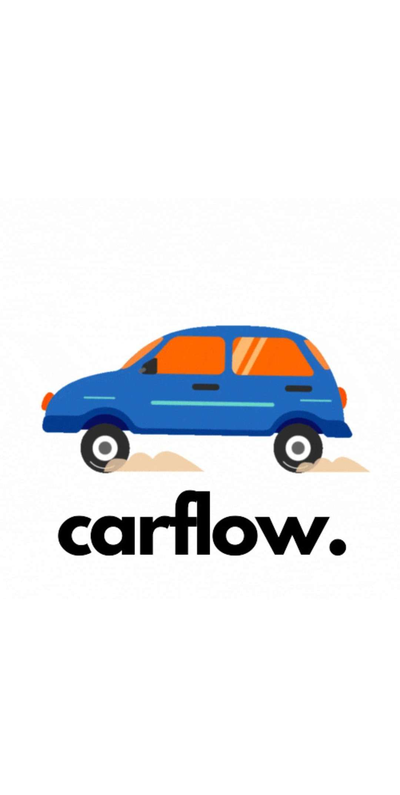

# Carflow.

> Our Journey started with the idea of a way to manage our time better. One of our problems with managing our time is the traffic we are usually stuck in.
We came with  way to help with that. With the help of our app you can check the traffic flow on the map and prevent being stuck in it with the help of our directions API
The API will guide you on the quickest route with the least traffic in order to help you get to your destination without any problems.

  

# Home 

>The Home Page will welcome you with a nice and simple button that will take you to the Map Page.

 

  

# Map

>The Map Page is the main attraction of our app. It will show you the traffic flow through the color of the street in our app.

  

# Sensors

>With the help of our sensors we can calcuate the amount of cars that are present on the street.

  

# Team members & their doing:

> - Togoe Radu Mihai : Mobile App Deveolpment
> - Vladu Marian Dumitru : Embedded and Simulation
> - Stefanescu Alexandru : Server Site and Embedded
> - Trifu Cosmin : Frontend and Design
